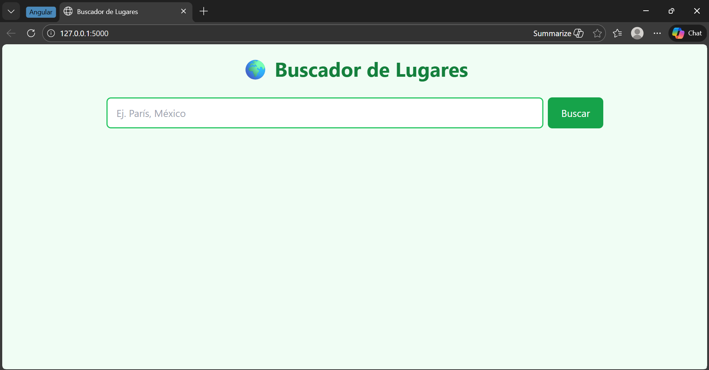
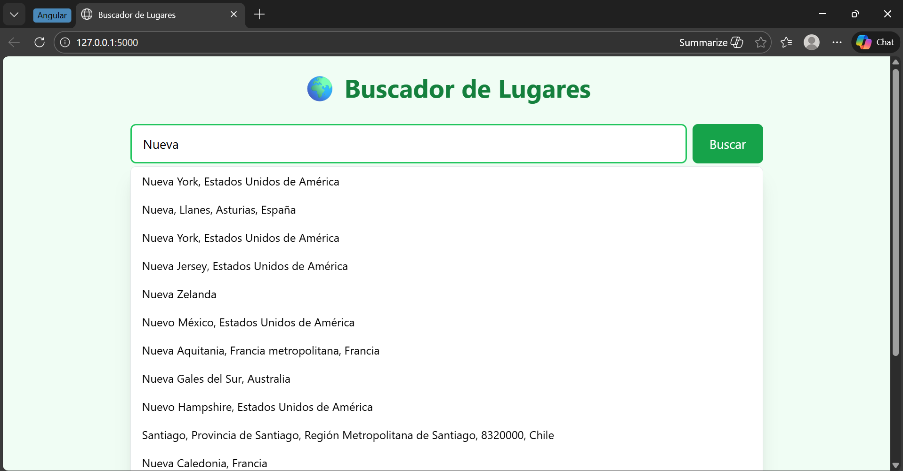
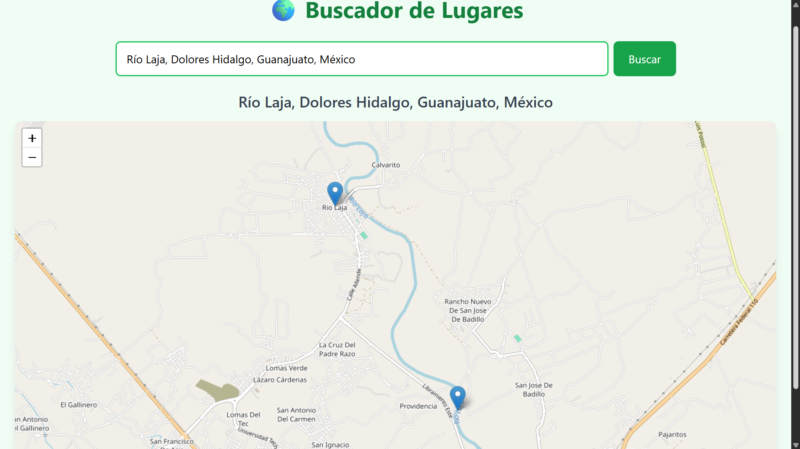

# 📘 Documentación del código Flask – Buscador de Lugares
Este proyecto es una aplicación web desarrollada con Flask que permite buscar lugares utilizando la API pública de OpenStreetMap (Nominatim) y mostrar los resultados en un mapa interactivo.
A continuación se explica detalladamente el funcionamiento de cada parte del código para comprender cómo trabaja Flask y cómo se integran las peticiones a una API externa.

---

## 📦 Importación de librerías

```python
from flask import Flask, render_template, request
import requests
```
**from flask import Flask, render_template, request**

Esta línea importa componentes esenciales del framework Flask:

- **Flask:**
Es la clase principal del framework. Se utiliza para crear la instancia de la aplicación web.
A partir de este objeto se definen rutas, se manejan peticiones HTTP y se ejecuta el servidor.

- **render_template:**
Función que permite renderizar archivos HTML ubicados en la carpeta templates.
Utiliza el motor de plantillas Jinja2, lo que permite insertar variables y lógica desde Python dentro del HTML.

- **request:**
Es un objeto especial de Flask que permite acceder a la información de las peticiones HTTP entrantes, como:
-- Datos enviados desde formularios
  - Datos enviados desde formularios.
  - Método de la petición (GET o POST).
  - Parámetros de la URL.
  - Cabeceras HTTP.

**import requests**

Se importa la librería externa requests, que se utiliza para realizar peticiones HTTP salientes desde Python hacia servicios externos.

📌 Es importante no confundir:

- **request** (Flask): maneja peticiones que llegan al servidor.
- **requests** (librería): se usa para enviar peticiones a otras APIs (en este caso, Nominatim).

---

## 🚀 Creación de la aplicación Flask

```python
app = Flask(__name__)
```
- Se crea una instancia de la clase Flask, la cual representa la aplicación web.
- **__name__** es una variable especial de Python que contiene el nombre del módulo actual.
- Flask utiliza este valor para:
  - Determinar la ruta base del proyecto.
  - Localizar las carpetas **templates** y **static**

En resumen, esta línea inicializa la aplicación y la deja lista para definir rutas y manejar solicitudes.

---

## 🛣️ Definición de la ruta principal

```python
@app.route('/', methods=['GET', 'POST'])
def buscar():
```
- **@app.route('/')** define la ruta principal de la aplicación (la raíz del sitio).
- **methods=['GET', 'POST']** indica que esta ruta acepta:
  - **GET:** cuando el usuario accede a la página por primera vez.
  - **POST:** cuando el usuario envía el formulario de búsqueda.

La función **buscar()** se ejecuta cada vez que se accede a esta ruta.

## 🧠 Inicialización de variables

```python
lugares = []
error = False
query = ""
```

- **lugares:** Lista que almacenará los resultados devueltos por la API (latitud, longitud y nombre del lugar).
- **error:** Bandera booleana que indica si la búsqueda no arrojó resultados. Se utiliza para mostrar mensajes de error en la interfaz.
- **query:** Guarda el texto ingresado por el usuario en el formulario de búsqueda.

---

## 📩 Manejo de la petición POST

```python
if request.method == 'POST':
    query = request.form['lugar']
```
- Se verifica si la petición es de tipo **POST**.
- **request.form['lugar']** obtiene el valor del campo **name="lugar"** del formulario HTML.
- Este valor representa el texto que el usuario desea buscar.

---

## 🌐 Consumo de la API Nominatim (OpenStreetMap)

```python
url = "https://nominatim.openstreetmap.org/search"
params = {
    'q': query,
    'format': 'json',
    'limit': 5
}
```
- **url:** endpoint de la API Nominatim para búsquedas geográficas.
- **params:**
  - **q:** término de búsqueda ingresado por el usuario.
  - **format:** formato de respuesta (JSON).
  - **limit:** número máximo de resultados a devolver.
 
---

## Cabeceras HTTP

```python
headers = {
    "User-Agent": "Flask-Educational-App"
}
```
- Nominatim exige que las peticiones incluyan un **User-Agent** identificable.
- Esto evita bloqueos y cumple con las políticas de uso de la API.

---

## Envío de la petición

```python
response = requests.get(url, params=params, headers=headers, timeout=5)
data = response.json()
```
- Se realiza una petición HTTP GET hacia la API.
- **timeout=5:** evita que la aplicación quede esperando indefinidamente.
- **response.json():** convierte la respuesta en una estructura de datos Python (lista de diccionarios).

---

## 📍 Procesamiento de resultados

```python
if data:
    for item in data:
        lugares.append({
            'lat': item['lat'],
            'lon': item['lon'],
            'nombre': item['display_name']
        })
else:
    error = True
```
- Si la API devuelve resultados:
  - Se recorre cada elemento y se extraen:
    - Latitud
    - Longitud
    - Nombre completo del lugar
  - Estos datos se almacenan en la lista **lugares**.
- Si no hay resultados:
  - Se activa la bandera **error** para notificar al usuario.

---

## 🖼️ Renderizado de la vista

```python
return render_template(
    'map.html',
    lugares=lugares,
    error=error,
    query=query
)
```
- Se renderiza el archivo **map.html**.
- Se envían variables al template:
  - **lugares:** lista de ubicaciones encontradas.
  - **error:** indica si ocurrió un error en la búsqueda.
  - **query:** texto buscado por el usuario.

Estas variables pueden utilizarse directamente en el HTML mediante Jinja2.

---

## ▶️ Ejecución de la aplicación

```python
if __name__ == '__main__':
    app.run(debug=True)
```
- Esta condición asegura que el servidor solo se ejecute cuando el archivo se ejecute directamente
- **debug=True:**
  - Muestra errores detallados en el navegador.
  - Recarga automáticamente la aplicación al detectar cambios en el código.

---

## 🧾 Conclusión

Este proyecto demuestra cómo Flask:
- Maneja rutas y peticiones HTTP
- Recibe datos de formularios
- Consume APIs externas
- Procesa datos en Python
- Renderiza vistas dinámicas con HTML

Además, integra buenas prácticas como el uso de cabeceras HTTP, control de errores y separación entre lógica de negocio y presentación.

---

## 🖼️ Capturas de pantalla

A continuación se muestran las vistas del proyecto:

### Barra de buscador


### Muestra de sugerencias de búsqueda


### Muestra de resultados de búsqueda

